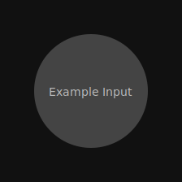
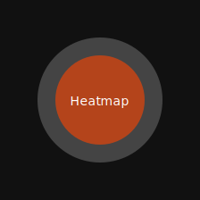

# Pneumonia Detection from Chest X-Ray Images

This project trains a deep learning model to detect pneumonia from chest X-ray images and generates Grad-CAM heatmap overlays to visualize the regions influencing the prediction.

## Project Structure
```
data/        # Downloaded dataset
models/      # Saved model checkpoints
outputs/     # Generated heatmaps and evaluation metrics
scripts/     # Helper scripts
src/         # Source code
```

## Dataset
This project uses the Kaggle Chest X-Ray Pneumonia dataset:
- https://www.kaggle.com/datasets/paultimothymooney/chest-xray-pneumonia

The dataset is downloaded automatically via `kagglehub`. To enable downloads, set Kaggle credentials:

```bash
export KAGGLE_USERNAME=YOUR_USERNAME
export KAGGLE_KEY=YOUR_API_KEY
```

Alternatively, place `kaggle.json` in `~/.kaggle/`.

## Setup
```bash
python -m venv .venv
source .venv/bin/activate
pip install -r requirements.txt
```

## Training
```bash
python -m src.train --epochs 5 --batch-size 16
```

## Evaluation
```bash
python -m src.evaluate --checkpoint models/pneumonia_resnet50.pt
```

Metrics are saved to `outputs/evaluation_metrics.txt` and include accuracy, precision, recall, and a confusion matrix.

## Inference + Heatmap
```bash
python -m src.infer --image path/to/xray.png --checkpoint models/pneumonia_resnet50.pt
```

The heatmap overlay is saved to `outputs/heatmap_overlay.png`.

## Streamlit App (Optional)
```bash
streamlit run src/app_streamlit.py
```

Upload an image to view the prediction and heatmap overlay.

## Example Output
Below are lightweight placeholder images (replace with real outputs after training):




## Notes on Accuracy
- The model uses transfer learning with ResNet-50 and data augmentation for strong baseline accuracy.
- For best results, train for more epochs and consider fine-tuning additional layers.

## License
For dataset licensing, refer to the Kaggle dataset page.
